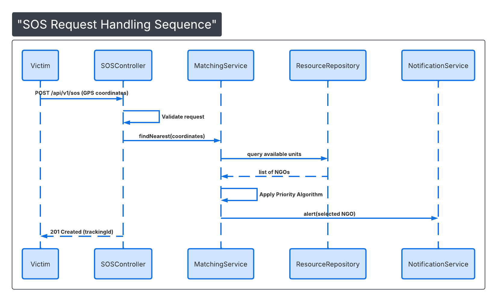

# Sequence Diagram: SOS Request Handling

## Logic Overview
This diagram illustrates the end-to-end lifecycle of an emergency SOS request within the **LifeSetu** backend.

### Key Execution Steps:
1. **Entry Point:** The Victim initiates a `POST` request to the `SOSController`.
2. **Validation:** The Controller ensures GPS coordinates and request types are valid before passing data to the service layer.
3. **Matching Logic:** The `MatchingService` orchestrates the retrieval of available units from the `ResourceRepository`.
4. **Prioritization:** A custom algorithm ranks resources based on proximity and urgency (Severity).
5. **Notification:** The `NotificationService` is triggered asynchronously to alert the nearest responder.
6. **Confirmation:** The Victim receives a `201 Created` status with a unique `trackingId` for real-time monitoring.