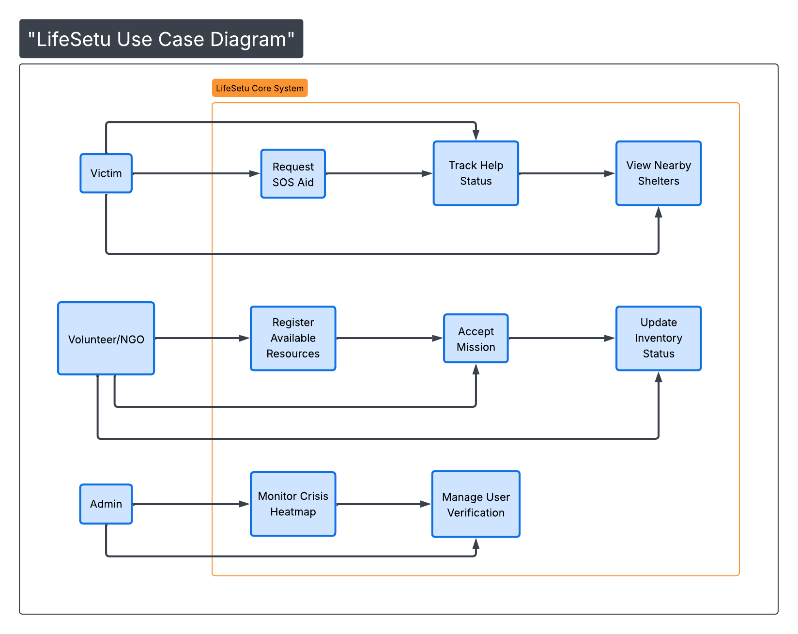

# Use Case Diagram: LifeSetu Core System

## 📌 Project Overview
**LifeSetu** is a high-stakes coordination engine designed to bridge the gap between disaster victims and resource providers. This diagram illustrates the functional boundaries of the system and how different actors interact with the backend services.

---

## 👥 Primary Actors

### 1. Victim (Citizen)
* **Role:** The "Demand" side of the platform.
* **Key Actions:** Initiates emergency signals and monitors aid arrival.

### 2. Volunteer / NGO
* **Role:** The "Supply" side of the platform.
* **Key Actions:** Manages resource inventory (ambulances, food, beds) and executes rescue/relief missions.

### 3. System Admin
* **Role:** The "Orchestrator" and "Verifier."
* **Key Actions:** Monitors real-time crisis data and ensures only verified users/NGOs are operating on the platform to prevent fraud.

---

## ⚙️ Functional Use Cases

| ID | Use Case | Description |
| :--- | :--- | :--- |
| **UC1** | Raise Emergency SOS | Allows victims to send an alert with precise GPS coordinates. |
| **UC2** | Track Help Status | Provides real-time updates on which NGO has accepted the request. |
| **UC3** | Register Resources | Enables NGOs to list available equipment and personnel. |
| **UC4** | Accept/Complete Task | The workflow for assigning a resource to a specific victim. |
| **UC5** | Monitor Hotspots | A dashboard view for admins to see where help is needed most. |
| **UC6** | Manage User Access | Security layer to verify NGO credentials and victim authenticity. |