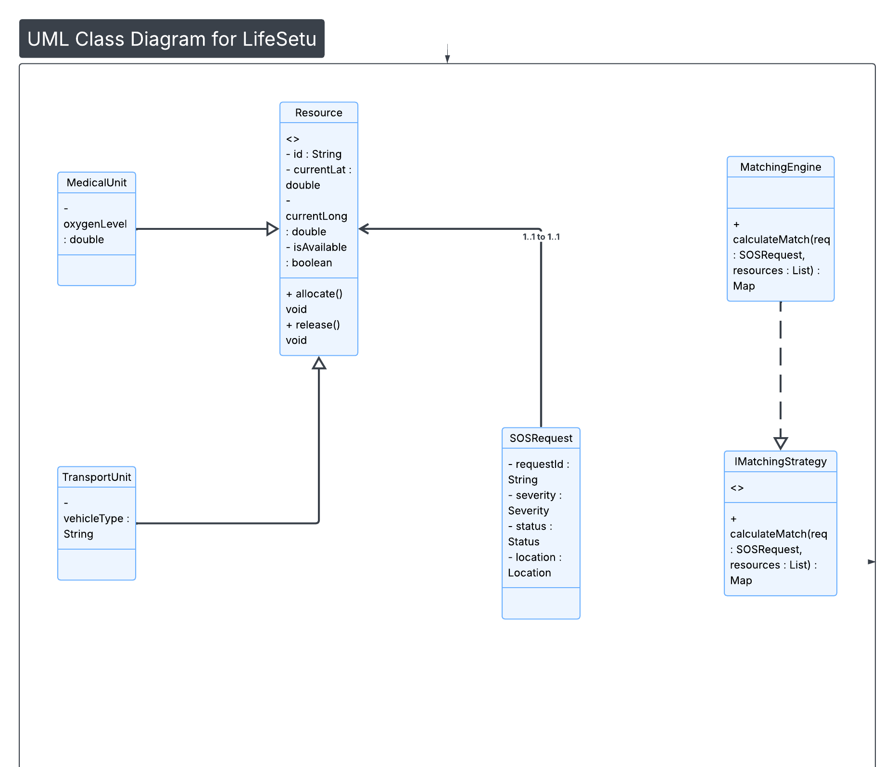

# Class Diagram: LifeSetu Architecture

##  OOP Principles Applied
This diagram represents the structural design of the backend, focusing on scalability and the **SOLID** principles.

### Key Design Elements:
* **Inheritance:** We use a base `Resource` class to encapsulate common properties, allowing for specialized units (Medical, Transport) to extend functionality.
* **Abstraction (Strategy Pattern):** The `IMatchingStrategy` interface allows the system to switch between different matching algorithms (e.g., Distance-based vs. Severity-based) without modifying the core service logic.
* **Encapsulation:** All entity fields are private, with access controlled through public methods (Getters/Setters), ensuring data integrity.